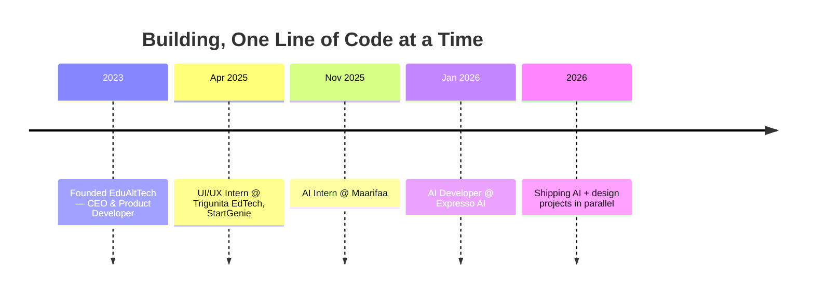

<div align="center">


<a href="https://github.com/AlRihabChandhiniMohammed">
  
</a>

<br/>

<a href="https://linkedin.com/in/your-linkedin"></a>
<a href="mailto:alrihabchandhinimohammed@gmail.com"></a>
<a href="https://github.com/AlRihabChandhiniMohammed"></a>
<a href="https://leetcode.com/u/chandhinimohammed/"></a>
<a href="https://www.hackerrank.com/profile/alrihabchandhin1"></a>


</div>


## 🌸 `whoami`


```yaml
chandhini_mohammed:
  role: "Founder & Product Developer, EduAltTech"
  also:
    - "AI Developer @ Expresso AI"
    - "AI Intern @ Maarifaa"
  studying: "B.Tech CSE @ JNTUK Kakinada · Expected 2027"
  based_in: "Pithapuram, Andhra Pradesh, India 🇮🇳"

  stack:
    languages: [C, Java, Python, JavaScript]
    web: [HTML, CSS, Node.js, Express]
    core: [Data Structures & Algorithms, SQL]
    ai_design: [Artificial Intelligence, Deep Learning, UI/UX Design, Figma]

  fun_fact: "Finalist @ Subu Kota Foundation Startup Fest 🎯"
  motto: "Design with empathy. Build with intelligence. ✨"

  status: currently_shipping 🌷
```

<br clear="right"/>


## 💻 Tech Arsenal

<div align="center">

**🧠 Languages**


<br/><br/>

**🎨 Frontend & Web**


<br/><br/>

**⚙️ Backend & Databases**


<br/><br/>

**🤖 AI / ML / Data**


<br/>


<br/><br/>

**🛠️ Tools & Platforms**


<br/><br/>


</div>

<br/>

## 🦋 Contribution Snake

<div align="center">

<!--START_SECTION:snake-->

<!--END_SECTION:snake-->

<sub>✨ Auto-generated nightly from live contribution graph — see setup note below</sub>

</div>


## 📊 The Numbers

<div align="center">


</div>


## 💼 Career Timeline



<details open>
<summary><b>🧠 Expresso AI — AI Developer</b> <sub>(Jan 2026 – Present)</sub></summary>
<br/>

`AI Model Integration` `System Architecture` `Anomaly Detection`

- Building an AI-powered behavioral intelligence platform for real-time interaction monitoring & anomaly detection
- Integrating AI models and designing system architecture for automated insights and secure virtual assessments

</details>

<details>
<summary><b>🌷 EduAltTech — CEO & Product Developer</b> <sub>(Dec 2023 – Present)</sub></summary>
<br/>

`Product Strategy` `Frontend` `Team Leadership`

- Leading the development and continuous improvement of the EduAltTech learning platform
- Designing product features and driving technical direction end-to-end
- Finalist, Subu Kota Foundation Startup Fest

</details>

<details>
<summary><b>💬 Maarifaa — AI Intern</b> <sub>(Nov 2025 – Present)</sub></summary>
<br/>

`ChromaDB` `RAG` `AI Applications`

- Building an AI-powered chatbot using ChromaDB for efficient data retrieval
- Developing AI-based applications and integrating intelligent features

</details>

<details>
<summary><b>🎨 Trigunita EdTech, StartGenie — UI/UX Intern</b> <sub>(Apr 2025 – Jun 2025 · Remote, Bengaluru)</sub></summary>
<br/>

`Figma` `Wireframing` `Prototyping`

- Designed user interfaces to improve usability and visual experience
- Created wireframes and prototypes for web-based learning platforms

</details>


## 🚀 Featured Builds

<div align="center">

| | Project | Stack | What it does |
|---|---|---|---|
| 🩺 | **[Healthcare AI Chatbot](https://github.com/AlRihabChandhiniMohammed/healthcare-ai-chatbot)** | Python · PyTorch · Hugging Face · NLTK · Streamlit | NLP-powered health assistant answering basic health queries via an interactive UI |
| 🍳 | **[Recipedia](https://github.com/AlRihabChandhiniMohammed/recipedia)** | React · Node.js · Express · MongoDB | Full-stack recipe-sharing platform — auth, saved collections, search & share |
| ✍️ | **[Scribble Writer](https://github.com/AlRihabChandhiniMohammed/scribble-writer)** | TensorFlow · OpenCV · Keras · Tesseract OCR | CRNN-based handwriting recognition turning notes into editable digital text |

</div>


## 🏆 Wins & Certifications

<div align="center">


| 🎖️ | Achievement | Details |
|:---:|---|---|
| 🎯 | **Finalist — Subu Kota Foundation Startup Fest** | Co-Founder & Product Developer, EduAltTech |
| 💯 | **200+ Problems Solved** | LeetCode & GeeksforGeeks · DSA focus |
| ⭐ | **4★ Coder — Python** | HackerRank |
| ⭐ | **3★ Coder — Java** | HackerRank |
| 📜 | **MERN Stack Web Development Internship** | EY GDS · AICTE · Edunet Foundation |
| 📜 | **Cisco AICTE Virtual Internship** | Cybersecurity |
| 📜 | **Computer Science 101** | edX |
| 📜 | **Introduction to Artificial Intelligence** | LinkedIn Learning |

</div>

## 🎓 Education

| Degree | Institution | Year | Score |
|---|---|:---:|:---:|
| B.Tech — Computer Science & Engineering | University College of Engineering, JNTUK Kakinada | Expected 2027 | In Progress |
| Intermediate (MPC) | Aditya College, Kakinada | 2021 – 2023 | 980 / 1000 |
| SSC (Class X) | Aditya High School, Pithapuram | 2021 | 593 / 600 |


## 🌟 Currently Leveling Up

<div align="center">

```text
🤖 AI & Deep Learning   ██████████████░░░░░░  70%   NLP, transformers, RAG pipelines
🎨 UI/UX Design         ████████████████░░░░  80%   Figma, wireframing, prototyping
🧩 DSA                  ███████████████░░░░░  75%   Data structures, competitive coding
🏗️ Product Strategy     █████████████░░░░░░░  65%   MVP scoping, roadmapping, GTM
📦 Full-Stack Dev       ███████████░░░░░░░░░  55%   Node, Express, MongoDB, React
```

</div>

## 💬 Random Dev Wisdom

<div align="center">

</div>


<div align="center">

### 🌸 Let's Build Something

[](https://linkedin.com/in/your-linkedin)
[](mailto:alrihabchandhinimohammed@gmail.com)
[](https://github.com/AlRihabChandhiniMohammed)

<br/>


</div>
